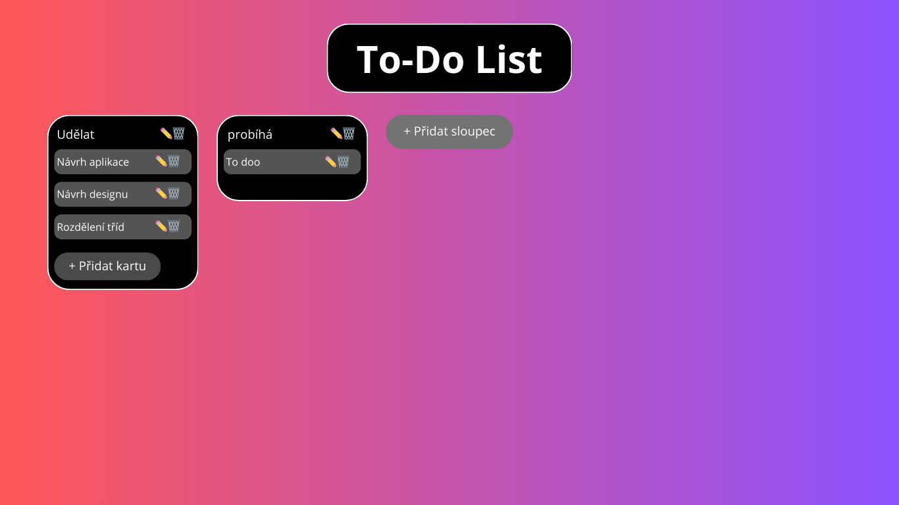

toto je readme na seminární práci:
1. Formulujte základní funkční požadavky a vytvořte funkční specifikaci. Ta bude mimo jiné obsahovat:
    charakteristika funkčností aplikace (UseCase diagram)
    specifikace uživatelských rolí a oprávnění (Specifikujte, jaké typy uživatelských jsou a jaký přístup a oprávnění mají)
    uživatelské grafické rozhraní a jeho funkčnosti (Může být doplněno o grafické návrhy, nákresy apod.)
    //splněno

2. Navrhněte technické řešení a vytvořte technickou specifikaci. Ta bude obsahovat následující:
    datový logický model
    popis architektury a jejích jednotlivých částí.
    popis tříd včetně základních funkcí, které by měly dané třídy plnit (Class diagram)
použité technologie a funkčnosti jednotlivých částí aplikace (např. html stránek, sekcí aplikace z pohledu uživatele apod.)
//?

UseCase diagram: 

Specifikace uživatelských rolí a oprávnění
    Aplikace bude mít pouze jednu roli, tedy „běžného uživatele“.
    Uživatelské oprávnění:
        Přidání, mazání a editace sloupců i karet.
        Přesouvání karet mezi sloupci
        Ukládání a načítání dat do LocalStorage.

Grafické rozhraní:
Hlavní panel (Board):
Zobrazuje sloupce s kartami a tlačítko pro přidání dalšího sloupce.
Sloupce (Columns):
Obsahují název sloupce včetně ikonek -> tužky pro editaci
                                     -> koše pro smazání sloupce.
Tlačítka pro přidání nové karty, popřípadě vytvořené karty.
Karty:
Obsahují text a ikony se stejnou funkcionalitou jako ve sloupcích.
Přetahovatelné mezi sloupci pomocí drag and drop.

Styly a návrh -> mělo by se to podobat aplikaci Trello.

obrázek návrhu:

Datový logický model
Aplikace je založena na objektovém modelu, kde data reprezentují sloupce a karty. Tyto objekty jsou uloženy v Local Storage.
Frontend:
    Implementován pomocí HTML, CSS a JavaScriptu.
    Dynamická správa DOM pomocí JavaScriptu.

Logika aplikace:
    Objektový přístup (třídy App, Column, Card).
    Lokální úložiště (localStorage) pro perzistenci dat.
    Drag-and-drop API pro manipulaci s kartami.

Uživatelské rozhraní (UI)
    Layout s CSS grid/flexboxem.
    Interaktivní prvky: tlačítka, formuláře, editovatelný text.
    Horizontální posouvání myší (scroll).

Class diagram: 

Technologie:
    HTML
        Struktura aplikace.
        Dynamické generování prvků pomocí JavaScriptu.
    CSS
        Stylizace aplikace.
    JavaScript
        OOP: Třídy App, Column, Card.
        Manipulace s DOM.
        Drag-and-Drop API.
        Uložení dat pomocí localStorage.
    Browser API
        Drag-and-drop: Přetahování karet mezi sloupci.
        Local Storage: Perzistence dat.
Funkčnosti jednotlivých částí aplikace

HTML Struktura:
Hlavní sekce (.board) obsahuje:
    Sloupce s kartami.
    Tlačítko na přidání formuláře
    Formuláře:
        Přidávání nových sloupců.
        Přidávání nových karet.

Sekce aplikace z pohledu uživatele:
    Sloupce:
        Možnost upravovat název.
        Možnost mazat sloupce.
        Drag-and-drop karet mezi sloupci.
    Karty:
        Možnost upravovat titulek.
        Možnost mazat karty.
        Drag-and-drop manipulace.
        Ukládání dat:
        Automatické ukládání změn do localStorage.
    Horizontální posouvání:
        Uživatelský komfort při práci s větším množstvím sloupců.

